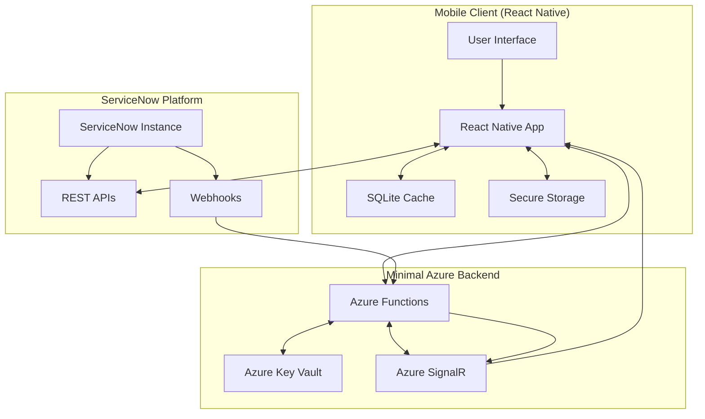
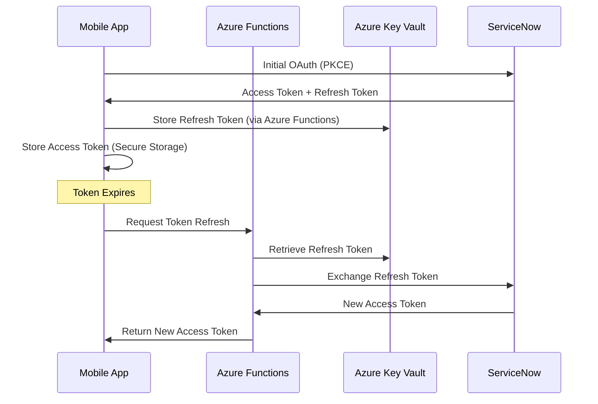

# FlowQuest Technical Architecture

## Architecture Overview

FlowQuest implements a **client-heavy, server-light** architecture that leverages ServiceNow's global infrastructure while providing a modern mobile experience with minimal backend costs.

### Core Architecture Principles

1. **Direct API Integration** - React Native clients communicate directly with ServiceNow APIs
2. **Local-First Data** - SQLite caching with smart synchronization strategies
3. **Minimal Backend** - Azure Functions handle only OAuth refresh and webhook processing
4. **Enterprise Security** - Leverage ServiceNow's proven security model
5. **Global Performance** - Utilize ServiceNow's 21 global data centers

## System Architecture Diagram



## Data Flow Architecture

### Primary Data Flow: Direct Client-to-ServiceNow

```
React Native ←→ ServiceNow REST APIs
     ↓
  SQLite Cache
     ↓  
 Secure Storage
```

**Benefits**:
- Minimal latency (no middleware proxy)
- Leverages ServiceNow's global CDN and regional optimization
- Enterprise-grade security and compliance
- No additional infrastructure costs for data operations

### Secondary Data Flow: Real-time Notifications

```
ServiceNow Webhook → Azure Functions → SignalR → React Native
```

**Purpose**: Push real-time updates for critical events (incident assignments, approvals, etc.)

## Component Architecture

### React Native Client Architecture

```
src/
├── components/           # Reusable UI components
│   ├── common/          # Shared components (cards, buttons, forms)
│   ├── animations/      # Lottie and Reanimated components
│   └── hubs/           # Hub-specific components
├── services/            # API and data services
│   ├── serviceNowApi/   # Direct ServiceNow API integration
│   ├── storage/         # SQLite and secure storage
│   ├── auth/           # OAuth and session management
│   └── sync/           # Data synchronization logic
├── store/              # State management (Zustand/Redux)
├── navigation/         # React Navigation setup
├── types/              # TypeScript definitions
└── utils/              # Helper functions and constants
```

### Hub Framework Architecture

Each hub is implemented as a self-contained module:

```typescript
interface Hub {
  name: string;
  icon: LottieSource;
  navigation: HubNavigationConfig;
  apiEndpoints: ServiceNowEndpoint[];
  cacheStrategy: CacheStrategy;
  realTimeEvents: WebhookEvent[];
}
```

**Hub Implementation Pattern**:
1. **Feed View** - Card-based list with infinite scroll
2. **Detail View** - Expandable sheet with progressive disclosure
3. **Action Layer** - Gesture-driven quick actions
4. **Animation Layer** - Micro-interactions and transitions

## Data Management Strategy

### Local Storage Architecture

#### SQLite Database Schema

```sql
-- Core tables for each hub
CREATE TABLE incidents (
  sys_id TEXT PRIMARY KEY,
  number TEXT NOT NULL,
  state INTEGER,
  priority INTEGER,
  assigned_to TEXT,
  description TEXT,
  sys_updated_on TIMESTAMP,
  cache_timestamp TIMESTAMP DEFAULT CURRENT_TIMESTAMP
);

CREATE TABLE assets (
  sys_id TEXT PRIMARY KEY,
  asset_tag TEXT,
  display_name TEXT,
  state INTEGER,
  model_category TEXT,
  assigned_to TEXT,
  sys_updated_on TIMESTAMP,
  cache_timestamp TIMESTAMP DEFAULT CURRENT_TIMESTAMP
);

-- Metadata tables
CREATE TABLE sync_metadata (
  table_name TEXT PRIMARY KEY,
  last_sync TIMESTAMP,
  sync_token TEXT
);

CREATE TABLE user_preferences (
  key TEXT PRIMARY KEY,
  value TEXT,
  updated_at TIMESTAMP DEFAULT CURRENT_TIMESTAMP
);
```

#### Smart Caching Strategy

**Cache Prioritization**:
1. **Hot Data** - Recently accessed records (cached for 24 hours)
2. **Warm Data** - User's assigned records (cached for 12 hours)
3. **Cold Data** - On-demand loading with 4-hour cache

**Cache Invalidation**:
- Real-time updates via webhooks
- Background sync every 15 minutes when app is active
- Pull-to-refresh user-initiated sync

#### Secure Storage

```typescript
interface SecureStorageKeys {
  // OAuth tokens
  ACCESS_TOKEN: string;
  REFRESH_TOKEN: string; // Stored in Azure Key Vault reference
  TOKEN_EXPIRES_AT: string;
  
  // User preferences
  NOTIFICATION_PREFERENCES: UserNotificationPrefs;
  BIOMETRIC_ENABLED: boolean;
  
  // Instance configuration
  SERVICENOW_INSTANCE_URL: string;
  USER_SYS_ID: string;
}
```

### Data Synchronization

#### Sync Strategy: Smart Incremental

**Initial App Launch**:
1. Authenticate with ServiceNow
2. Load user's priority records (assigned incidents, recent assets)
3. Background sync for remaining data

**Ongoing Sync**:
- **Push Updates**: Real-time via webhooks → Azure Functions → SignalR
- **Pull Updates**: Incremental sync using `sys_updated_on` timestamps
- **Conflict Resolution**: ServiceNow is source of truth, local changes queued for retry

#### Offline Capability: Read-Only MVP

**MVP Offline Features**:
- ✅ View cached incidents, assets, people data
- ✅ Search cached data
- ✅ View record details and related records
- ❌ No offline actions (comments, assignments, state changes)

**Future Enhancement**: Limited offline actions with sync queue

## Backend Architecture: Ultra-Minimal Azure

### Azure Functions (Consumption Plan)

**Function 1: OAuth Token Refresh**
```typescript
// Function: refresh-token
export async function refreshToken(request: HttpRequest, context: InvocationContext) {
  // Retrieve refresh token from Key Vault
  // Exchange with ServiceNow for new access token
  // Return new token (do not store)
}
```

**Function 2: Webhook Handler**
```typescript
// Function: servicenow-webhook
export async function webhookHandler(request: HttpRequest, context: InvocationContext) {
  // Validate webhook signature
  // Process ServiceNow event
  // Send real-time notification via SignalR
}
```

**Cost Structure**:
- **Executions**: ~10,000/month (OAuth refreshes + webhooks)
- **Duration**: ~100ms average per execution
- **Memory**: 128MB
- **Estimated Cost**: $0 (within free tier limits)

### Azure Key Vault

**Stored Secrets**:
- ServiceNow OAuth client credentials
- Webhook signature validation keys
- SignalR connection strings

**Cost**: $3/month (Basic tier)

### Azure SignalR Service

**Configuration**:
- **Tier**: Free (20 concurrent connections)
- **Usage**: Real-time notifications to mobile clients
- **Scaling**: Pay-per-use beyond free tier

**Cost**: $0-5/month depending on concurrent users

## Security Architecture

### Authentication & Authorization Flow



### Security Best Practices

**Client-Side Security**:
- OAuth PKCE flow for public clients
- Access tokens in secure keychain/keystore
- Certificate pinning for ServiceNow connections
- Biometric authentication for app access

**Backend Security**:
- Minimal attack surface (2 functions only)
- No persistent data storage
- Webhook signature validation
- Azure Key Vault for secrets management

**ServiceNow Integration**:
- OAuth 2.0 with appropriate scopes
- IP allowlisting for webhook endpoints
- TLS 1.3 for all API communications

## Performance Architecture

### Mobile Performance Optimization

**Rendering Performance**:
- React Native Reanimated 3 (UI thread animations)
- Lottie animations with caching
- Image optimization and lazy loading
- List virtualization for large datasets

**Network Performance**:
- Request batching and debouncing
- Intelligent caching with cache-first strategies
- Compression for API responses
- Connection pooling for HTTP requests

**Memory Management**:
- SQLite query optimization
- Image memory management
- Component lazy loading
- Background task optimization

### Scalability Considerations

**Client Scalability**:
- Stateless architecture (no server-side sessions)
- Direct ServiceNow API usage (leverages their scaling)
- Local SQLite handles offline performance

**Backend Scalability**:
- Azure Functions auto-scaling
- Pay-per-execution model
- SignalR Service handles connection scaling

## Monitoring & Observability

### Application Performance Monitoring

**Mobile Metrics**:
- App launch time and performance
- API response times and error rates
- Cache hit/miss ratios
- Animation frame rates (target: 60+ FPS)

**Backend Metrics**:
- Function execution duration and success rates
- Token refresh frequency and success rates
- Webhook processing times
- SignalR connection health

### Error Handling & Logging

**Client-Side Error Handling**:
```typescript
interface ApiError {
  code: string;
  message: string;
  details?: any;
  retry: boolean;
  userMessage: string;
}
```

**Backend Logging**:
- Structured logging with Azure Application Insights
- Error correlation across function executions
- Performance bottleneck identification

## Development Environment

### Docker Containerization

**Architecture**: Monorepo with containerized development services

```
FlowQuest/
├── .devcontainer/          # Cursor IDE development container
├── docker-compose.dev.yml  # Local development services
├── mobile/                 # React Native app
├── backend/                # Azure Functions
└── shared/                 # TypeScript shared types
```

**Services**:
- **PostgreSQL**: Local ServiceNow data mocking and testing
- **Redis**: Caching and session management
- **Development Container**: Node.js, React Native CLI, Android SDK

**Benefits**:
- Consistent development environment across team members
- No local Node.js/Android SDK installation required
- Instant project onboarding with Cursor IDE integration

## Deployment Architecture

### Mobile App Deployment

**iOS Deployment**:
- Xcode Cloud or GitHub Actions
- TestFlight for beta distribution
- App Store for production release

**Android Deployment**:
- GitHub Actions with Android build tools
- Google Play Console for distribution
- Internal testing via Play Console

### Backend Deployment

**Azure Functions Deployment**:
```yaml
# GitHub Actions workflow
- name: Deploy Azure Functions
  uses: azure/functions-action@v1
  with:
    app-name: flowquest-functions
    package: ./backend-dist
```

**Infrastructure as Code**:
- Azure Resource Manager (ARM) templates
- Bicep for infrastructure definition
- Environment-specific configurations

## Future Architecture Considerations

### Phase 2 Enhancements

**Enhanced Offline Support**:
- Offline action queuing with conflict resolution
- Local transaction management
- Background sync optimization

**Advanced Caching**:
- Predictive data prefetching
- Machine learning for cache optimization
- Cross-device cache synchronization

**Multi-Tenant Support**:
- Support for multiple ServiceNow instances
- Tenant-specific configurations
- Cross-tenant data isolation

### Scaling Considerations

**Performance Scaling**:
- CDN integration for static assets
- Regional deployment strategies
- Advanced caching layers

**Feature Scaling**:
- Plugin architecture for custom workflows
- Third-party integration framework
- Advanced analytics and reporting

## Technology Stack Summary

### Frontend
- **Framework**: React Native 0.76+ (New Architecture)
- **Language**: TypeScript 5.3+
- **State Management**: Zustand or Redux Toolkit
- **Navigation**: React Navigation 6
- **Animations**: React Native Reanimated 3, Lottie
- **Storage**: SQLite (react-native-sqlite-storage), Secure Storage
- **HTTP Client**: Axios with request/response interceptors

### Backend
- **Platform**: Azure Functions (Node.js runtime)
- **Language**: TypeScript
- **Storage**: Azure Key Vault (secrets only)
- **Real-time**: Azure SignalR Service
- **Monitoring**: Azure Application Insights

### DevOps
- **CI/CD**: GitHub Actions
- **Testing**: Jest, Detox (E2E)
- **Code Quality**: ESLint, Prettier, Husky
- **Documentation**: TypeScript annotations, API documentation

This architecture provides enterprise-grade security, performance, and scalability while maintaining minimal operational costs and complexity.