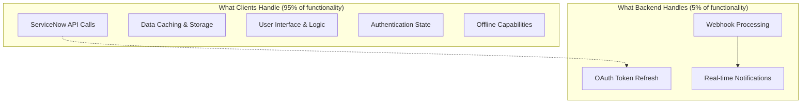
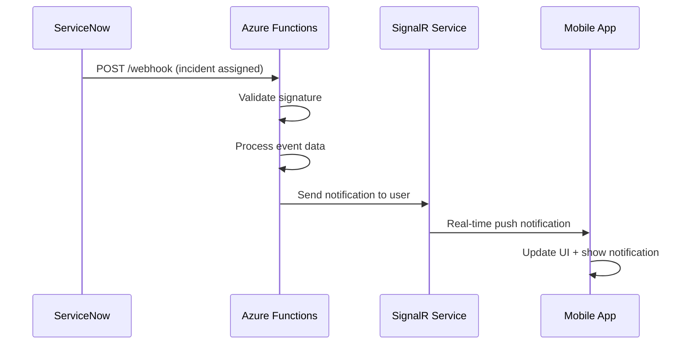

# FlowQuest Minimal Backend Architecture

## Philosophy: Ultra-Minimal Server-Side Footprint

FlowQuest's backend strategy is **radically minimal** - only handling what absolutely cannot be done client-side. This approach achieves enterprise-grade functionality at ~$5-10/month while maintaining security and scalability.

## Core Principle: Client-Heavy, Server-Light



## Backend Service Architecture

### Azure Functions: Consumption Plan

**Why Azure Functions?**
- **Cost**: Pay per execution (~10,000/month = $0 with free tier)
- **Scalability**: Auto-scales from 0 to thousands of concurrent executions
- **Simplicity**: No server management, automatic deployments
- **Integration**: Native Azure Key Vault and SignalR integration

**Function App Structure**:
```
flowquest-backend/
├── src/
│   ├── functions/
│   │   ├── oauth-refresh.ts      # OAuth token refresh endpoint
│   │   ├── servicenow-webhook.ts # Webhook event processing
│   │   └── health-check.ts       # Simple health monitoring
│   ├── services/
│   │   ├── keyVault.ts          # Azure Key Vault client
│   │   ├── signalR.ts           # Real-time notifications
│   │   └── serviceNow.ts        # ServiceNow API client
│   └── types/
│       ├── webhook.types.ts     # ServiceNow webhook schemas
│       └── auth.types.ts        # OAuth response schemas
├── package.json
├── tsconfig.json
└── host.json                    # Azure Functions configuration
```

## Function 1: OAuth Token Refresh

### Purpose & Security Rationale

**Why Backend Token Refresh?**
- **Security**: Refresh tokens are long-lived and more sensitive than access tokens
- **Best Practice**: OAuth spec recommends refresh tokens never touch client storage
- **Compliance**: Enterprise security policies often require server-side token handling

### Implementation

```typescript
// src/functions/oauth-refresh.ts
import { app, HttpRequest, HttpResponse, InvocationContext } from '@azure/functions';
import { getKeyVaultSecret } from '../services/keyVault';
import { refreshServiceNowToken } from '../services/serviceNow';

interface RefreshTokenRequest {
  userSysId: string;
  instanceUrl: string;
}

interface RefreshTokenResponse {
  accessToken: string;
  expiresIn: number;
  tokenType: 'Bearer';
}

app.http('oauth-refresh', {
  methods: ['POST'],
  authLevel: 'function', // Requires function key
  handler: async (request: HttpRequest, context: InvocationContext): Promise<HttpResponse> => {
    try {
      const body = await request.json() as RefreshTokenRequest;
      const { userSysId, instanceUrl } = body;
      
      // Input validation
      if (!userSysId || !instanceUrl) {
        return { 
          status: 400, 
          jsonBody: { error: 'Missing required parameters' }
        };
      }
      
      // Retrieve refresh token from Key Vault
      // Key format: "refresh-token-{userSysId}-{instanceHash}"
      const instanceHash = instanceUrl.replace(/https?:\/\//, '').replace(/\./g, '-');
      const secretName = `refresh-token-${userSysId}-${instanceHash}`;
      
      const refreshToken = await getKeyVaultSecret(secretName);
      if (!refreshToken) {
        return { 
          status: 404, 
          jsonBody: { error: 'Refresh token not found' }
        };
      }
      
      // Exchange refresh token for new access token
      const tokenResponse = await refreshServiceNowToken({
        refreshToken,
        instanceUrl,
        clientId: process.env.SERVICENOW_CLIENT_ID!,
        clientSecret: process.env.SERVICENOW_CLIENT_SECRET!
      });
      
      context.log(`Token refresh successful for user ${userSysId}`);
      
      return {
        status: 200,
        jsonBody: {
          accessToken: tokenResponse.access_token,
          expiresIn: tokenResponse.expires_in,
          tokenType: 'Bearer'
        } as RefreshTokenResponse
      };
      
    } catch (error) {
      context.error('Token refresh failed:', error);
      
      return {
        status: 500,
        jsonBody: { error: 'Token refresh failed' }
      };
    }
  }
});
```

### Security Configuration

```typescript
// src/services/keyVault.ts
import { DefaultAzureCredential } from '@azure/identity';
import { SecretClient } from '@azure/keyvault-secrets';

class KeyVaultService {
  private client: SecretClient;
  
  constructor() {
    const credential = new DefaultAzureCredential();
    const vaultUrl = `https://${process.env.KEY_VAULT_NAME}.vault.azure.net/`;
    this.client = new SecretClient(vaultUrl, credential);
  }
  
  async getSecret(secretName: string): Promise<string | null> {
    try {
      const secret = await this.client.getSecret(secretName);
      return secret.value || null;
    } catch (error) {
      if (error.code === 'SecretNotFound') {
        return null;
      }
      throw error;
    }
  }
  
  async setSecret(secretName: string, value: string): Promise<void> {
    await this.client.setSecret(secretName, value, {
      expiresOn: new Date(Date.now() + 90 * 24 * 60 * 60 * 1000) // 90 days
    });
  }
}

export const keyVaultService = new KeyVaultService();
export const getKeyVaultSecret = (name: string) => keyVaultService.getSecret(name);
export const setKeyVaultSecret = (name: string, value: string) => keyVaultService.setSecret(name, value);
```

## Function 2: ServiceNow Webhook Handler

### Purpose & Real-time Strategy

**Why Webhooks?**
- **Real-time Updates**: Instant notification of incident assignments, approvals
- **Efficiency**: Push updates vs polling (reduces API calls and battery usage)
- **User Experience**: Live updates create responsive, modern app feeling

### Webhook Processing Flow



### Implementation

```typescript
// src/functions/servicenow-webhook.ts
import { app, HttpRequest, HttpResponse, InvocationContext } from '@azure/functions';
import { validateWebhookSignature } from '../services/serviceNow';
import { sendRealTimeNotification } from '../services/signalR';

interface ServiceNowWebhookEvent {
  event_type: string;
  table: string;
  operation: 'insert' | 'update' | 'delete';
  record: {
    sys_id: string;
    number: string;
    assigned_to: string;
    state: string;
    priority: string;
    short_description: string;
    [key: string]: any;
  };
  user: {
    sys_id: string;
    name: string;
  };
  timestamp: string;
}

interface NotificationPayload {
  type: 'incident_assigned' | 'incident_updated' | 'approval_requested';
  title: string;
  body: string;
  data: {
    recordId: string;
    recordNumber: string;
    table: string;
  };
}

app.http('servicenow-webhook', {
  methods: ['POST'],
  authLevel: 'function',
  handler: async (request: HttpRequest, context: InvocationContext): Promise<HttpResponse> => {
    try {
      // Validate webhook signature
      const signature = request.headers.get('x-servicenow-signature');
      const body = await request.text();
      
      if (!validateWebhookSignature(body, signature)) {
        context.warn('Invalid webhook signature');
        return { status: 401, jsonBody: { error: 'Invalid signature' } };
      }
      
      const event: ServiceNowWebhookEvent = JSON.parse(body);
      context.log(`Received webhook: ${event.event_type} for ${event.table}:${event.record.number}`);
      
      // Process different event types
      const notification = await processWebhookEvent(event, context);
      
      if (notification) {
        // Send real-time notification to assigned user
        const targetUserId = event.record.assigned_to;
        await sendRealTimeNotification(targetUserId, notification);
        
        context.log(`Notification sent to user ${targetUserId}`);
      }
      
      return { status: 200, jsonBody: { received: true } };
      
    } catch (error) {
      context.error('Webhook processing failed:', error);
      return { status: 500, jsonBody: { error: 'Webhook processing failed' } };
    }
  }
});

async function processWebhookEvent(
  event: ServiceNowWebhookEvent, 
  context: InvocationContext
): Promise<NotificationPayload | null> {
  
  const { table, operation, record } = event;
  
  // Only process specific high-value events
  if (table === 'incident' && operation === 'update') {
    
    // Incident assigned to user
    if (record.assigned_to && record.state === '2') { // In Progress state
      return {
        type: 'incident_assigned',
        title: `Incident ${record.number} Assigned`,
        body: record.short_description.substring(0, 100),
        data: {
          recordId: record.sys_id,
          recordNumber: record.number,
          table: 'incident'
        }
      };
    }
    
    // High priority incident updated
    if (record.priority === '1' || record.priority === '2') {
      return {
        type: 'incident_updated',
        title: `P${record.priority} Incident Updated`,
        body: `${record.number}: ${record.short_description.substring(0, 80)}`,
        data: {
          recordId: record.sys_id,
          recordNumber: record.number,
          table: 'incident'
        }
      };
    }
  }
  
  // Change approval requested
  if (table === 'sysapproval_approver' && operation === 'insert') {
    return {
      type: 'approval_requested',
      title: 'Approval Requested',
      body: `Change ${record.number} requires your approval`,
      data: {
        recordId: record.sys_id,
        recordNumber: record.number,
        table: 'change_request'
      }
    };
  }
  
  return null; // Event not processed
}
```

## Real-time Notification Service

### Azure SignalR Integration

```typescript
// src/services/signalR.ts
import { WebPubSubServiceClient } from '@azure/web-pubsub';

class RealTimeNotificationService {
  private client: WebPubSubServiceClient;
  
  constructor() {
    const connectionString = process.env.SIGNALR_CONNECTION_STRING!;
    this.client = new WebPubSubServiceClient(connectionString, 'flowquest-notifications');
  }
  
  async sendToUser(userId: string, notification: any): Promise<void> {
    try {
      // Send to specific user group
      await this.client.sendToGroup(`user-${userId}`, notification, {
        contentType: 'application/json'
      });
    } catch (error) {
      console.error(`Failed to send notification to user ${userId}:`, error);
      throw error;
    }
  }
  
  async addUserToGroup(userId: string, connectionId: string): Promise<void> {
    await this.client.addConnectionToGroup(`user-${userId}`, connectionId);
  }
  
  async removeUserFromGroup(userId: string, connectionId: string): Promise<void> {
    await this.client.removeConnectionFromGroup(`user-${userId}`, connectionId);
  }
}

export const signalRService = new RealTimeNotificationService();
export const sendRealTimeNotification = (userId: string, notification: any) =>
  signalRService.sendToUser(userId, notification);
```

### Mobile Client Integration

```typescript
// React Native client SignalR connection
import { HubConnectionBuilder, LogLevel } from '@microsoft/signalr';

class FlowQuestNotificationService {
  private connection: HubConnection | null = null;
  private userSysId: string;
  
  constructor(userSysId: string) {
    this.userSysId = userSysId;
  }
  
  async connect(): Promise<void> {
    // Get SignalR connection URL from Azure Function
    const response = await fetch(`${AZURE_FUNCTIONS_URL}/api/signalr-negotiate`, {
      method: 'POST',
      headers: {
        'Authorization': `Bearer ${accessToken}`,
        'Content-Type': 'application/json'
      },
      body: JSON.stringify({ userId: this.userSysId })
    });
    
    const { url, accessToken: signalRToken } = await response.json();
    
    this.connection = new HubConnectionBuilder()
      .withUrl(url, { accessTokenFactory: () => signalRToken })
      .withAutomaticReconnect()
      .configureLogging(LogLevel.Information)
      .build();
    
    // Handle incoming notifications
    this.connection.on('notification', (notification: NotificationPayload) => {
      this.handleNotification(notification);
    });
    
    await this.connection.start();
  }
  
  private handleNotification(notification: NotificationPayload): void {
    // Show local push notification
    PushNotification.localNotification({
      title: notification.title,
      message: notification.body,
      userInfo: notification.data
    });
    
    // Update local cache/UI
    EventEmitter.emit('realtime-update', notification);
  }
}
```

## Function 3: Health Check & Monitoring

### Simple Health Endpoint

```typescript
// src/functions/health-check.ts
import { app, HttpRequest, HttpResponse, InvocationContext } from '@azure/functions';

interface HealthCheckResponse {
  status: 'healthy' | 'degraded' | 'unhealthy';
  timestamp: string;
  version: string;
  services: {
    keyVault: 'up' | 'down';
    signalR: 'up' | 'down';
  };
}

app.http('health', {
  methods: ['GET'],
  authLevel: 'anonymous',
  handler: async (request: HttpRequest, context: InvocationContext): Promise<HttpResponse> => {
    try {
      const health: HealthCheckResponse = {
        status: 'healthy',
        timestamp: new Date().toISOString(),
        version: process.env.npm_package_version || '1.0.0',
        services: {
          keyVault: 'up', // Could add actual health checks
          signalR: 'up'
        }
      };
      
      return { status: 200, jsonBody: health };
      
    } catch (error) {
      return {
        status: 503,
        jsonBody: {
          status: 'unhealthy',
          timestamp: new Date().toISOString(),
          error: 'Health check failed'
        }
      };
    }
  }
});
```

## Infrastructure as Code

### Azure Resource Manager Template

```json
{
  "$schema": "https://schema.management.azure.com/schemas/2019-04-01/deploymentTemplate.json#",
  "contentVersion": "1.0.0.0",
  "parameters": {
    "appName": {
      "type": "string",
      "defaultValue": "flowquest"
    },
    "environment": {
      "type": "string",
      "allowedValues": ["dev", "staging", "prod"],
      "defaultValue": "dev"
    }
  },
  "variables": {
    "functionAppName": "[concat(parameters('appName'), '-functions-', parameters('environment'))]",
    "keyVaultName": "[concat(parameters('appName'), '-kv-', parameters('environment'))]",
    "signalRName": "[concat(parameters('appName'), '-signalr-', parameters('environment'))]"
  },
  "resources": [
    {
      "type": "Microsoft.KeyVault/vaults",
      "apiVersion": "2021-11-01-preview",
      "name": "[variables('keyVaultName')]",
      "location": "[resourceGroup().location]",
      "properties": {
        "sku": { "name": "standard", "family": "A" },
        "tenantId": "[subscription().tenantId]",
        "enabledForDeployment": false,
        "enabledForTemplateDeployment": false,
        "enabledForDiskEncryption": false,
        "enableRbacAuthorization": true
      }
    },
    {
      "type": "Microsoft.SignalRService/signalR",
      "apiVersion": "2021-10-01",
      "name": "[variables('signalRName')]",
      "location": "[resourceGroup().location]",
      "sku": {
        "name": "Free_F1",
        "capacity": 1
      },
      "properties": {
        "features": [
          {
            "flag": "ServiceMode",
            "value": "Serverless"
          }
        ]
      }
    },
    {
      "type": "Microsoft.Web/sites",
      "apiVersion": "2021-02-01",
      "name": "[variables('functionAppName')]",
      "location": "[resourceGroup().location]",
      "kind": "functionapp,linux",
      "properties": {
        "siteConfig": {
          "linuxFxVersion": "NODE|18",
          "appSettings": [
            {
              "name": "FUNCTIONS_EXTENSION_VERSION",
              "value": "~4"
            },
            {
              "name": "FUNCTIONS_WORKER_RUNTIME",
              "value": "node"
            }
          ]
        }
      }
    }
  ]
}
```

## Cost Analysis & Optimization

### Expected Monthly Costs

#### Azure Functions (Consumption Plan)
```
Estimated Usage:
- OAuth Refresh: ~5,000 executions/month (users refresh tokens)
- Webhook Processing: ~3,000 executions/month (real-time events)
- Health Checks: ~2,000 executions/month (monitoring)

Total: ~10,000 executions/month
Cost: $0 (within 1M execution free tier)

Memory Usage: 128MB average, 100ms duration
GB-seconds: 10,000 * 0.128 * 0.1 = 128 GB-seconds
Cost: $0 (within 400,000 GB-s free tier)
```

#### Azure Key Vault
```
Usage:
- Secret Operations: ~5,000/month (token storage/retrieval)
- Secrets Stored: ~100 (user refresh tokens)

Cost: $3.00/month (Standard tier)
```

#### Azure SignalR Service
```
Usage:
- Connections: ~50 concurrent (free tier limit)
- Messages: ~10,000/month (real-time notifications)

Cost: $0 (Free tier: up to 20 concurrent connections)
```

**Total Monthly Cost: ~$3-5/month**

### Cost Optimization Strategies

#### Function Optimization
```typescript
// Minimize cold start times
export const warmup = async (context: InvocationContext) => {
  // Pre-initialize services
  await Promise.all([
    keyVaultService.initialize(),
    signalRService.initialize()
  ]);
};

// Efficient memory usage
const processInBatches = async <T>(
  items: T[], 
  batchSize: number, 
  processor: (batch: T[]) => Promise<void>
) => {
  for (let i = 0; i < items.length; i += batchSize) {
    const batch = items.slice(i, i + batchSize);
    await processor(batch);
  }
};
```

#### Resource Management
```typescript
// Connection pooling for external APIs
class ServiceNowApiClient {
  private static instance: ServiceNowApiClient;
  private httpAgent: any;
  
  constructor() {
    this.httpAgent = new (require('https').Agent)({
      keepAlive: true,
      maxSockets: 50,
      timeout: 10000
    });
  }
  
  static getInstance() {
    if (!ServiceNowApiClient.instance) {
      ServiceNowApiClient.instance = new ServiceNowApiClient();
    }
    return ServiceNowApiClient.instance;
  }
}
```

## Deployment & CI/CD

### GitHub Actions Workflow

```yaml
name: Deploy FlowQuest Backend

on:
  push:
    branches: [main]
    paths: ['backend/**']

jobs:
  deploy:
    runs-on: ubuntu-latest
    steps:
      - uses: actions/checkout@v3
      
      - name: Setup Node.js
        uses: actions/setup-node@v3
        with:
          node-version: '18'
          cache: 'npm'
          cache-dependency-path: backend/package-lock.json
      
      - name: Install dependencies
        working-directory: ./backend
        run: npm ci
      
      - name: Build TypeScript
        working-directory: ./backend
        run: npm run build
      
      - name: Deploy to Azure Functions
        uses: azure/functions-action@v1
        with:
          app-name: flowquest-functions-prod
          package: ./backend/dist
          publish-profile: ${{ secrets.AZURE_FUNCTIONAPP_PUBLISH_PROFILE }}
```

## Monitoring & Observability

### Application Insights Integration

```typescript
// Application Insights logging
import { DefaultTelemetryClient } from '@azure/monitor-opentelemetry';

class TelemetryService {
  private client = new DefaultTelemetryClient();
  
  trackEvent(name: string, properties?: Record<string, string>) {
    this.client.trackEvent({ name, properties });
  }
  
  trackException(error: Error, properties?: Record<string, string>) {
    this.client.trackException({ exception: error, properties });
  }
  
  trackMetric(name: string, value: number) {
    this.client.trackMetric({ name, value });
  }
}

export const telemetry = new TelemetryService();
```

### Performance Monitoring

```typescript
// Function performance tracking
const trackFunctionPerformance = (functionName: string) => {
  return (target: any, propertyKey: string, descriptor: PropertyDescriptor) => {
    const originalMethod = descriptor.value;
    
    descriptor.value = async function (...args: any[]) {
      const startTime = Date.now();
      
      try {
        const result = await originalMethod.apply(this, args);
        
        telemetry.trackMetric(`${functionName}.duration`, Date.now() - startTime);
        telemetry.trackMetric(`${functionName}.success`, 1);
        
        return result;
      } catch (error) {
        telemetry.trackMetric(`${functionName}.error`, 1);
        telemetry.trackException(error as Error, { functionName });
        throw error;
      }
    };
    
    return descriptor;
  };
};

// Usage
class WebhookService {
  @trackFunctionPerformance('webhook.process')
  async processWebhook(event: ServiceNowWebhookEvent) {
    // Processing logic
  }
}
```

## Security Best Practices

### Function-Level Security

```typescript
// Request validation middleware
const validateRequest = (requiredHeaders: string[] = []) => {
  return (req: HttpRequest): boolean => {
    // Validate required headers
    for (const header of requiredHeaders) {
      if (!req.headers.get(header)) {
        return false;
      }
    }
    
    // Rate limiting (simple implementation)
    const clientIP = req.headers.get('x-forwarded-for') || 'unknown';
    return rateLimiter.isAllowed(clientIP);
  };
};

// ServiceNow webhook signature validation
const validateWebhookSignature = (body: string, signature: string): boolean => {
  const expectedSignature = crypto
    .createHmac('sha256', process.env.WEBHOOK_SECRET!)
    .update(body)
    .digest('hex');
    
  return crypto.timingSafeEqual(
    Buffer.from(signature, 'hex'),
    Buffer.from(expectedSignature, 'hex')
  );
};
```

This minimal backend architecture achieves enterprise-grade functionality while maintaining ultra-low operational costs and complexity, perfectly complementing FlowQuest's client-heavy approach.