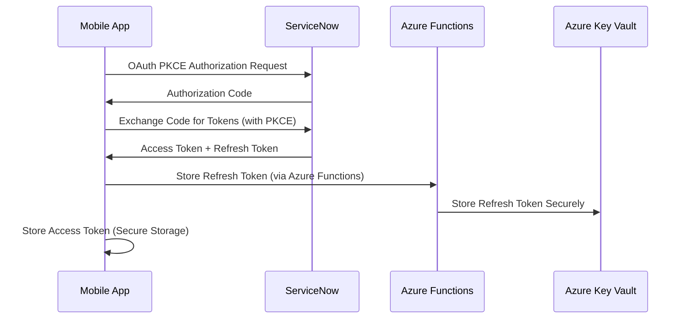
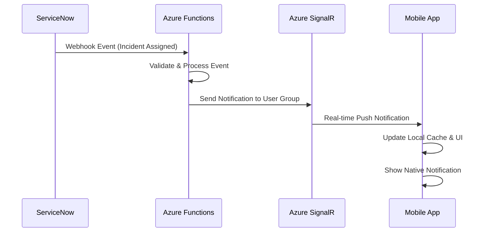

# ServiceNow Integration - Product Requirements Document

## Overview

Establish secure, efficient, and real-time integration between FlowQuest mobile app and ServiceNow instances using OAuth 2.0 authentication, direct REST API communication, and webhook-driven real-time updates.

## Problem Statement

Current ServiceNow mobile integration challenges:
- Complex authentication flows requiring multiple redirects and manual steps
- No real-time notifications for critical incidents or approvals
- API responses designed for web interfaces, not optimized for mobile
- Offline capability limited or non-existent
- Multiple ServiceNow instances require separate authentication

## Solution

**Direct API Integration**: React Native app communicates directly with ServiceNow REST APIs, eliminating middleware latency
**OAuth 2.0 PKCE Flow**: Secure authentication designed for mobile clients with refresh token management
**Real-time Webhooks**: ServiceNow webhooks trigger instant mobile notifications via Azure SignalR
**Smart Caching**: SQLite-based local storage with intelligent sync strategies

## User Stories

### Authentication Stories
- **As a ServiceNow user**, I want to log in once and stay authenticated securely, so I don't have to re-enter credentials constantly
- **As a mobile user**, I want biometric authentication (Face ID/fingerprint), so login is quick and secure
- **As an enterprise user**, I want to switch between multiple ServiceNow instances, so I can work across different environments

### Real-time Integration Stories
- **As an incident resolver**, I want instant notifications when incidents are assigned to me, so I can respond immediately
- **As an approver**, I want to receive mobile notifications for pending approvals, so I don't delay business processes
- **As a manager**, I want real-time updates on critical incidents, so I can escalate when needed

### Offline Capability Stories
- **As a field technician**, I want to view incident details offline, so I can work without constant connectivity
- **As a mobile user**, I want my actions queued when offline, so they're applied when connectivity returns
- **As a user**, I want visual indicators showing what data is cached vs live, so I understand data freshness

## Technical Requirements

### OAuth 2.0 Authentication
- **PKCE Flow**: Proof Key for Code Exchange for public mobile clients
- **Refresh Token Management**: Secure token refresh via Azure Functions
- **Biometric Integration**: Touch ID/Face ID for quick re-authentication
- **Multi-instance Support**: Manage authentication for multiple ServiceNow environments

### REST API Integration
- **Direct Communication**: React Native → ServiceNow APIs (no middleware proxy)
- **Request Optimization**: Batch requests, field limiting, response compression
- **Error Handling**: Comprehensive error handling with retry logic
- **Rate Limiting**: Respect ServiceNow API rate limits with backoff strategies

### Real-time Webhook System
- **ServiceNow Webhooks**: Configure webhooks for critical events (incidents, approvals, assignments)
- **Azure Functions Processing**: Lightweight webhook processing and validation
- **SignalR Distribution**: Real-time push to mobile clients
- **Event Filtering**: Only process high-value events to reduce noise

### Local Data Management
- **SQLite Database**: Structured local storage for ServiceNow data
- **Smart Caching**: Priority-based caching (user's assigned records first)
- **Sync Strategies**: Incremental sync using sys_updated_on timestamps
- **Conflict Resolution**: ServiceNow as source of truth, local changes queued

## Implementation Architecture

### Authentication Flow


### Real-time Event Flow


### Data Synchronization Strategy
- **Initial Load**: User's assigned records and high-priority items
- **Incremental Sync**: Use `sys_updated_on` > last_sync_timestamp
- **Real-time Updates**: Webhook events update specific records immediately
- **Background Sync**: Periodic sync every 15 minutes when app active

## API Integration Specifications

### Core ServiceNow APIs
```typescript
interface ServiceNowAPIClient {
  // Table API for CRUD operations
  table: {
    get: (table: string, sysId?: string, params?: QueryParams) => Promise<TableResponse>;
    post: (table: string, data: any) => Promise<TableRecord>;
    patch: (table: string, sysId: string, data: any) => Promise<TableRecord>;
    delete: (table: string, sysId: string) => Promise<void>;
  };

  // Aggregate API for analytics
  aggregate: {
    query: (table: string, params: AggregateParams) => Promise<AggregateResponse>;
  };

  // Attachment API for file operations
  attachment: {
    upload: (file: File, tableName: string, sysId: string) => Promise<AttachmentResponse>;
    download: (attachmentSysId: string) => Promise<Blob>;
  };

  // User API for profile information
  user: {
    getProfile: () => Promise<UserProfile>;
    getPreferences: () => Promise<UserPreferences>;
  };
}
```

### Request Optimization
- **Field Selection**: Only request needed fields using `sysparm_fields`
- **Response Limits**: Use `sysparm_limit` to prevent large responses
- **Compression**: Enable gzip compression for API responses
- **Caching**: HTTP cache headers for static data (choice lists, etc.)

### Error Handling Strategy
```typescript
interface APIErrorHandler {
  // Retry logic for transient failures
  retry: {
    maxAttempts: 3;
    backoffStrategy: 'exponential' | 'linear';
    retryableErrors: [401, 429, 500, 502, 503, 504];
  };

  // User-friendly error messages
  errorMapping: {
    401: 'Authentication expired, please log in again';
    403: 'You do not have permission to access this resource';
    429: 'Too many requests, please wait a moment';
    500: 'ServiceNow server error, please try again later';
  };
}
```

## Security Requirements

### Data Protection
- **Encryption at Rest**: SQLite database encrypted with device keychain
- **Encryption in Transit**: TLS 1.3 for all API communications
- **Certificate Pinning**: Pin ServiceNow SSL certificates
- **Token Security**: Access tokens in secure keychain, refresh tokens in Azure Key Vault

### Authentication Security
- **PKCE Implementation**: Proper code verifier and challenge generation
- **Token Refresh**: Automatic refresh before expiration
- **Session Management**: Clear tokens on app uninstall or explicit logout
- **Biometric Authentication**: Optional Face ID/Touch ID for quick access

### API Security
- **Request Signing**: HMAC signature for webhook validation
- **Rate Limiting**: Respect and implement client-side rate limiting
- **Input Validation**: Sanitize all user input before API calls
- **Error Handling**: Never expose sensitive information in error messages

## Acceptance Criteria

### Must Have - Authentication
- [ ] OAuth 2.0 PKCE flow successfully authenticates users
- [ ] Biometric authentication (Face ID/Touch ID) works for app access
- [ ] Automatic token refresh prevents authentication failures
- [ ] Multi-instance support allows switching between ServiceNow environments

### Must Have - API Integration
- [ ] Successfully retrieve incident, change, and asset data from ServiceNow
- [ ] CRUD operations (create, read, update, delete) work for all core record types
- [ ] API error handling provides user-friendly messages and retry logic
- [ ] Request optimization reduces data usage and improves performance

### Must Have - Real-time Features
- [ ] Webhook events trigger real-time notifications in mobile app
- [ ] Critical incident assignments result in immediate mobile notifications
- [ ] Real-time updates reflect in UI without manual refresh
- [ ] Notification preferences allow users to control what they receive

### Should Have - Offline Capabilities
- [ ] Core ServiceNow data cached locally in SQLite database
- [ ] App functions with basic read operations when offline
- [ ] Visual indicators show cached vs live data status
- [ ] Automatic sync when connectivity restored

### Could Have - Advanced Features
- [ ] Offline action queuing with sync when online
- [ ] Predictive caching based on user behavior patterns
- [ ] Cross-instance data correlation and switching
- [ ] Advanced webhook filtering and processing

## Performance Requirements

### Response Times
- **Authentication**: <3 seconds for OAuth flow completion
- **API Calls**: <2 seconds for typical incident/asset queries
- **Real-time Notifications**: <5 seconds from ServiceNow event to mobile notification
- **Sync Operations**: <30 seconds for full incremental sync

### Data Usage
- **Initial Sync**: <50MB for typical user's data set
- **Incremental Sync**: <5MB per sync operation
- **Real-time Updates**: <1KB per webhook event
- **Offline Operation**: 90% of common operations available offline

### Battery Impact
- **Background Sync**: <2% battery drain per hour
- **Real-time Connections**: SignalR connection optimized for battery life
- **API Efficiency**: Batch operations to reduce individual request overhead

## Implementation Phases

### Phase 1: Core Authentication
- OAuth 2.0 PKCE flow implementation
- Basic ServiceNow API client
- Token management and refresh logic

### Phase 2: Data Operations
- CRUD operations for incidents, changes, assets
- Local SQLite database setup
- Basic sync strategies

### Phase 3: Real-time Integration
- ServiceNow webhook configuration
- Azure Functions webhook processing
- SignalR real-time notifications

### Phase 4: Offline & Advanced Features
- Comprehensive offline capabilities
- Action queuing and conflict resolution
- Multi-instance support and advanced caching

## ServiceNow Configuration Requirements

### OAuth Application Setup
```javascript
// ServiceNow OAuth Application Configuration
{
  "name": "FlowQuest Mobile App",
  "client_type": "public", // For mobile PKCE flow
  "grant_types": ["authorization_code", "refresh_token"],
  "redirect_uris": ["flowquest://oauth/callback"],
  "scopes": ["useraccount", "glide.read", "glide.write", "user_profile"],
  "pkce_required": true
}
```

### Webhook Configuration
- **Business Rules**: Create business rules to trigger webhooks on incident/change events
- **REST Message**: Configure outbound REST messages to Azure Functions endpoints
- **Event Filtering**: Only send webhooks for high-priority events (P1/P2 incidents, approvals)

---

**Priority**: P0 (Critical)
**Estimate**: 4-6 sprints
**Dependencies**: Azure Functions backend, ServiceNow instance configuration, SSL certificate resolution
**Success Criteria**: Seamless, secure integration that feels native while providing real-time ServiceNow data access