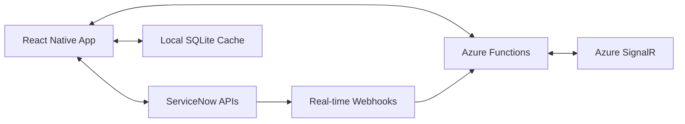

# FlowQuest 🚀

> **An Experimental Mobile Interface for ServiceNow**

Exploring ways to make ServiceNow mobile workflows more intuitive and engaging through modern mobile UX patterns.

[](https://reactnative.dev/)
[](https://www.typescriptlang.org/)
[](https://www.servicenow.com/)
[](https://azure.microsoft.com/en-us/products/functions)
[](https://opensource.org/licenses/MIT)

## 💡 The Idea

ServiceNow's current mobile experience involves many navigation steps:
```
Home → Menu → ITSM → Incident Management → Open Incidents → 
Select Incident → Form View → Actions Menu → Resolve → Submit
```

FlowQuest explores whether gesture-based interactions could simplify this:
```
Swipe card left → Tap resolve → Done
```

The goal is to test if modern mobile UX patterns can make ServiceNow workflows faster and more enjoyable.

## 🎯 Key Features

### 🏠 Hub-Based Navigation (Planned)
Exploring simpler navigation with focused hubs:
- **Work Hub** - Incidents, Problems, Changes, Requests
- **Assets Hub** - Hardware, Software, Contracts, Lifecycle tracking
- **People Hub** - HR Cases, Onboarding, Customer service
- **Me Hub** - Profile, preferences, contributions, notifications

### 🎨 Mobile UX Experiments
- **Card-based interfaces** instead of data tables
- **Gesture-driven actions** (swipe to resolve, drag to assign)
- **Progressive disclosure** (expandable sheets with tabs)
- **Smooth animations** using React Native Reanimated 3
- **Micro-interactions** for better feedback

### ⚡ Performance-First Architecture
- **Direct ServiceNow API integration** (no middleware latency)
- **Smart local caching** with SQLite
- **Real-time notifications** via Azure SignalR
- **Ultra-minimal backend** costs (~$5-10/month)

## 🏗️ Architecture Overview

FlowQuest experiments with a **client-heavy, server-light** architecture:



**Benefits:**
- ✅ **Minimal Infrastructure Costs** - Azure Functions consumption plan (~$5-10/month)
- ✅ **Enterprise Security** - Leverage ServiceNow's proven security model
- ✅ **Global Performance** - Utilize ServiceNow's 21 global data centers
- ✅ **Offline Capability** - Smart caching for mobile-first experience

## 🚀 Quick Start

### Prerequisites
- **Docker Desktop** - For PostgreSQL and Redis development services
- **Node.js 18+** - For React Native development
- **iOS Simulator** - macOS with Xcode for iOS development
- **ServiceNow Instance** - Vancouver, Washington, or Zurich release (future integration)
- **Azure Account** - For minimal backend functions (future deployment)

### Development Setup

**Current Status**: Environment functional with limitations (see Technical Issues below)

#### Quick Start - Current Working Method

```bash
# Clone the repository
git clone https://github.com/stormy2021/FlowQuestv2.git
cd FlowQuestv2

# Start development services (PostgreSQL, Redis)
npm run docker:dev

# Install dependencies
cd mobile
npm install --legacy-peer-deps

# Start Metro bundler (keep this running)
npm start

# Open iOS Simulator
open -a Simulator

# In iOS Simulator, open Safari and navigate to:
# http://localhost:8081
```

#### Alternative Setup (When Issues Resolved)

```bash
# Future: Native iOS build (currently blocked by infrastructure issues)
npx expo run:ios

# Future: Android build
npx expo run:android
```

#### Docker Services

When using Docker setup:
- **PostgreSQL**: `localhost:5432` (db: flowquest_dev, user: flowquest)
- **Redis**: `localhost:6379`
- **React Native Metro**: `localhost:8081`

## ⚠️ Current Technical Status

### Working Configuration
- ✅ **Development Environment**: Metro + Safari workflow functional
- ✅ **Feature Development**: Ready for PRD implementation
- ✅ **Docker Services**: PostgreSQL and Redis operational
- ✅ **Basic Navigation**: Hub structure with placeholder screens

### Critical Issues (P0)
- 🚨 **CocoaPods SSL Certificate** - Blocking full Expo testing capabilities
- 🚨 **@babel/runtime Module Resolution** - JavaScript bundle generation fails
- **Workaround**: Using Metro web interface via iOS Simulator Safari

### Development Strategy
- **Current Approach**: Build features using Metro + Safari while resolving infrastructure issues
- **Parallel Track**: Resolve CocoaPods and babel issues for production deployment
- **Goal**: Full Expo testing capabilities for TestFlight and App Store deployment

For detailed issue tracking, see: `docs/ISSUES.md`

### Future ServiceNow Configuration

Once integration features are implemented:

1. **OAuth Application Setup** in ServiceNow
2. **API Scope Configuration** (useraccount, glide.read, glide.write, user_profile)
3. **Webhook Endpoints** for real-time notifications
4. **Environment Configuration** with ServiceNow instance details

See: `prds/servicenow-integration.md` for detailed integration requirements.

## 📱 Screenshots

| Work Hub | Asset Carousel | Incident Details | Quick Actions |
|----------|----------------|------------------|---------------|
|  |  |  |  |

## 🎨 Animation Showcase

FlowQuest brings ServiceNow to life with engaging animations:

- **Card Transitions** - Smooth shared-element animations between views
- **Progress Indicators** - Animated arcs showing SLA compliance  
- **Celebration Effects** - Lottie animations for completed tasks
- **Micro-interactions** - Haptic feedback and spring animations
- **Loading States** - Skeleton screens with shimmer effects

*Built with React Native Reanimated 3 for 60+ FPS performance*

## 🛠️ Technical Stack

### Frontend
- **React Native 0.76+** with New Architecture
- **TypeScript** for type safety
- **React Native Reanimated 3** for high-performance animations
- **Lottie** for vector animations
- **SQLite** for local caching
- **Zustand** for state management

### Backend (Minimal)
- **Azure Functions** (Consumption Plan)
- **Azure Key Vault** for secure secret storage
- **Azure SignalR** for real-time notifications
- **TypeScript** with Node.js runtime

### Development Tools
- **GitHub Actions** for CI/CD
- **Jest** for unit testing
- **Detox** for E2E testing
- **ESLint & Prettier** for code quality

## 📚 Documentation

### Product Requirements
- [**Product Requirements**](./prds/) - Focused PRD documents for each major feature
  - `work-hub-mvp.md` - Core incident management with card interface
  - `asset-management.md` - ITAM lifecycle and contract management
  - `people-hr-workflows.md` - HR onboarding and case management
  - `user-experience-gamification.md` - Personal achievements and contributions
  - `servicenow-integration.md` - OAuth 2.0 and real-time API integration
  - `offline-caching-system.md` - SQLite caching and synchronization

### Technical Documentation
- [**Technical Architecture**](./docs/ARCHITECTURE.md) - Detailed system architecture
- [**Client Architecture**](./docs/CLIENT_ARCHITECTURE.md) - React Native implementation details
- [**Backend Guide**](./docs/MINIMAL_BACKEND.md) - Azure Functions minimal backend
- [**Development Workflow**](./docs/DEVELOPMENT.md) - Daily development commands
- [**Issue Tracking**](./docs/ISSUES.md) - Current technical issues and solutions

### Historical Reference
- [**Historical Documentation**](./archive/) - Past debugging sessions and archived planning

## 🤝 Contributing

This is my first open-source project, so I'm learning as I go! Contributions and feedback are very welcome from:

- **ServiceNow Developers** - API integration suggestions and workflow improvements
- **Mobile Engineers** - React Native best practices and performance tips
- **UX Designers** - Mobile design patterns and user experience feedback  
- **Anyone** - Bug reports, feature ideas, or general suggestions

### Getting Started
1. Fork the repository
2. Create a feature branch: `git checkout -b feature/amazing-feature`
3. Commit your changes: `git commit -m 'Add amazing feature'`
4. Push to the branch: `git push origin feature/amazing-feature`
5. Open a Pull Request

See [CONTRIBUTING.md](./CONTRIBUTING.md) for detailed guidelines.

## 📊 Current Development Roadmap

### Phase 1: Core Features (Current - Next 4 weeks)
**Status**: Ready to begin from PRD documents
- 🔄 **Work Hub MVP** - Card-based incident interface with swipe gestures
- 🔄 **Mock ServiceNow Data** - Realistic test data for immediate development
- 🔄 **Priority Visual System** - Color-coded cards with pulsing animations
- 🔄 **Basic Gesture System** - Swipe-to-resolve with haptic feedback

### Phase 2: Extended Hubs (Weeks 5-8)
**Dependencies**: Work Hub MVP complete
- 🔄 **Asset Management** - Lifecycle visualization and contract alerts
- 🔄 **People Hub** - HR onboarding gamification
- 🔄 **Me Hub** - Personal achievements and contribution tracking

### Phase 3: ServiceNow Integration (Weeks 9-12)
**Prerequisites**: Infrastructure issues resolved
- 🔄 **OAuth 2.0 PKCE** - Secure ServiceNow authentication
- 🔄 **Real-time Webhooks** - Instant notifications via Azure SignalR
- 🔄 **Direct API Integration** - Replace mock data with live ServiceNow data

### Phase 4: Production Readiness (Weeks 13-16)
**Requirements**: Full native build capabilities
- 📋 **Offline SQLite Caching** - Smart sync and conflict resolution
- 📋 **Performance Optimization** - 60+ FPS animations on devices
- 📋 **TestFlight Beta** - Device testing and user feedback
- 📋 **App Store Submission** - Production release preparation

### Infrastructure Blockers (Parallel Track)
**Critical**: Resolve for production deployment
- 🚨 **CocoaPods SSL Certificate Issue** - Enable full Expo testing
- 🚨 **@babel/runtime Module Resolution** - Fix JavaScript bundle generation
- **Target**: Resolve by end of Phase 2 for Phase 3 integration work

## 🤔 Why This Project?

### Personal Goals
- Learn React Native and modern mobile development
- Explore whether ServiceNow mobile workflows can be improved
- Practice building and maintaining an open-source project
- Share learnings with the ServiceNow community

### Potential Benefits (If Successful)
- Faster common ServiceNow workflows on mobile
- More engaging mobile experience for ServiceNow users
- Learning resource for others interested in ServiceNow mobile development
- Demonstration of client-heavy architecture patterns

## 📄 License

This project is licensed under the MIT License - see the [LICENSE](LICENSE) file for details.

## 🙏 Acknowledgments

- **ServiceNow Community** for inspiration and feedback
- **React Native Team** for the amazing framework
- **Azure Functions Team** for serverless computing excellence
- **Open Source Contributors** who make projects like this possible

## 📧 Support & Contact

- **Issues**: [GitHub Issues](https://github.com/yourusername/flowquest/issues)
- **Discussions**: [GitHub Discussions](https://github.com/yourusername/flowquest/discussions)
- **ServiceNow Community**: [FlowQuest Community Group](https://community.servicenow.com/)

---

<div align="center">

**⭐ Star this repo if you're interested in better ServiceNow mobile experiences!**

*Learning mobile development through ServiceNow workflow improvements*

</div>