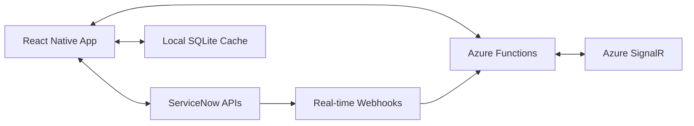

# FlowQuest 🚀

> **An Experimental Mobile Interface for ServiceNow**

Exploring ways to make ServiceNow mobile workflows more intuitive and engaging through modern mobile UX patterns.

[](https://reactnative.dev/)
[](https://www.typescriptlang.org/)
[](https://www.servicenow.com/)
[](https://azure.microsoft.com/en-us/products/functions)
[](https://opensource.org/licenses/MIT)

## 💡 The Idea

ServiceNow's current mobile experience involves many navigation steps:
```
Home → Menu → ITSM → Incident Management → Open Incidents → 
Select Incident → Form View → Actions Menu → Resolve → Submit
```

FlowQuest explores whether gesture-based interactions could simplify this:
```
Swipe card left → Tap resolve → Done
```

The goal is to test if modern mobile UX patterns can make ServiceNow workflows faster and more enjoyable.

## 🎯 Key Features

### 🏠 Hub-Based Navigation (Planned)
Exploring simpler navigation with focused hubs:
- **Work Hub** - Incidents, Problems, Changes, Requests
- **Assets Hub** - Hardware, Software, Contracts, Lifecycle tracking
- **People Hub** - HR Cases, Onboarding, Customer service
- **Me Hub** - Profile, preferences, contributions, notifications

### 🎨 Mobile UX Experiments
- **Card-based interfaces** instead of data tables
- **Gesture-driven actions** (swipe to resolve, drag to assign)
- **Progressive disclosure** (expandable sheets with tabs)
- **Smooth animations** using React Native Reanimated 3
- **Micro-interactions** for better feedback

### ⚡ Performance-First Architecture
- **Direct ServiceNow API integration** (no middleware latency)
- **Smart local caching** with SQLite
- **Real-time notifications** via Azure SignalR
- **Ultra-minimal backend** costs (~$5-10/month)

## 🏗️ Architecture Overview

FlowQuest experiments with a **client-heavy, server-light** architecture:



**Benefits:**
- ✅ **Minimal Infrastructure Costs** - Azure Functions consumption plan (~$5-10/month)
- ✅ **Enterprise Security** - Leverage ServiceNow's proven security model
- ✅ **Global Performance** - Utilize ServiceNow's 21 global data centers
- ✅ **Offline Capability** - Smart caching for mobile-first experience

## 🚀 Quick Start

### Prerequisites
- **Docker Desktop** - For containerized development environment
- **Cursor IDE** - Recommended (or VS Code with Dev Containers extension)
- **ServiceNow Instance** - Vancouver, Washington, or Zurich release
- **Mobile Development** - iOS 13+ / Android 7.0+ target devices (for testing)
- **Azure Account** - For minimal backend functions (optional for development)

### Development Setup

#### Option 1: Docker Development Environment (Recommended)

```bash
# Clone the repository
git clone https://github.com/yourusername/flowquest.git
cd flowquest

# Start development services (PostgreSQL, Redis)
npm run docker:dev

# View running containers
docker ps

# Check service logs
npm run docker:logs

# Stop services when done
npm run docker:down
```

#### Option 2: Cursor IDE Integration

1. Open project in Cursor IDE
2. When prompted, choose "Reopen in Container"
3. Development environment will automatically build and start
4. All services (Node.js, PostgreSQL, Redis, Android SDK) ready to use

#### Option 3: Traditional Setup

```bash
# Install dependencies across monorepo
npm install

# Start React Native Metro bundler
npm run mobile:start

# Run on iOS (new terminal)
npm run mobile:ios

# Run on Android (new terminal)
npm run mobile:android
```

### Development Services

When using Docker setup:
- **PostgreSQL**: `localhost:5432` (db: flowquest_dev, user: flowquest)
- **Redis**: `localhost:6379`
- **React Native Metro**: `localhost:8081`

### ServiceNow Configuration

1. **Create OAuth Application** in ServiceNow:
   ```
   System OAuth > Application Registry > Create > OAuth API endpoint for external clients
   ```

2. **Configure API Scopes**:
   ```
   useraccount, glide.read, glide.write, user_profile
   ```

3. **Set Webhook Endpoints** (for real-time features):
   ```
   https://your-azure-function.azurewebsites.net/api/servicenow-webhook
   ```

### Environment Configuration

Create `.env` file in the project root:

```env
# ServiceNow Configuration
SERVICENOW_INSTANCE_URL=https://your-instance.service-now.com
OAUTH_CLIENT_ID=your-oauth-client-id
OAUTH_CLIENT_SECRET=your-oauth-client-secret

# Azure Configuration (Optional)
AZURE_FUNCTIONS_ENDPOINT=https://your-function-app.azurewebsites.net
SIGNALR_CONNECTION_STRING=your-signalr-connection-string
```

## 📱 Screenshots

| Work Hub | Asset Carousel | Incident Details | Quick Actions |
|----------|----------------|------------------|---------------|
|  |  |  |  |

## 🎨 Animation Showcase

FlowQuest brings ServiceNow to life with engaging animations:

- **Card Transitions** - Smooth shared-element animations between views
- **Progress Indicators** - Animated arcs showing SLA compliance  
- **Celebration Effects** - Lottie animations for completed tasks
- **Micro-interactions** - Haptic feedback and spring animations
- **Loading States** - Skeleton screens with shimmer effects

*Built with React Native Reanimated 3 for 60+ FPS performance*

## 🛠️ Technical Stack

### Frontend
- **React Native 0.76+** with New Architecture
- **TypeScript** for type safety
- **React Native Reanimated 3** for high-performance animations
- **Lottie** for vector animations
- **SQLite** for local caching
- **Zustand** for state management

### Backend (Minimal)
- **Azure Functions** (Consumption Plan)
- **Azure Key Vault** for secure secret storage
- **Azure SignalR** for real-time notifications
- **TypeScript** with Node.js runtime

### Development Tools
- **GitHub Actions** for CI/CD
- **Jest** for unit testing
- **Detox** for E2E testing
- **ESLint & Prettier** for code quality

## 📚 Documentation

- [**Architecture Guide**](./ARCHITECTURE.md) - Detailed technical architecture
- [**Client Architecture**](./docs/CLIENT_ARCHITECTURE.md) - React Native implementation details
- [**Backend Guide**](./docs/MINIMAL_BACKEND.md) - Azure Functions setup
- [**API Integration**](./docs/API_INTEGRATION.md) - ServiceNow API usage patterns
- [**Design System**](./docs/UI_DESIGN_SYSTEM.md) - Component library and animations

## 🤝 Contributing

This is my first open-source project, so I'm learning as I go! Contributions and feedback are very welcome from:

- **ServiceNow Developers** - API integration suggestions and workflow improvements
- **Mobile Engineers** - React Native best practices and performance tips
- **UX Designers** - Mobile design patterns and user experience feedback  
- **Anyone** - Bug reports, feature ideas, or general suggestions

### Getting Started
1. Fork the repository
2. Create a feature branch: `git checkout -b feature/amazing-feature`
3. Commit your changes: `git commit -m 'Add amazing feature'`
4. Push to the branch: `git push origin feature/amazing-feature`
5. Open a Pull Request

See [CONTRIBUTING.md](./CONTRIBUTING.md) for detailed guidelines.

## 📊 Roadmap

### Phase 1: MVP (Q1 2025)
- 🔄 Core hub framework (Work, Assets, People, Me)
- 🔄 Direct ServiceNow API integration
- 🔄 Basic animations and gestures
- 🔄 Local caching with SQLite
- 🔄 OAuth authentication flow

### Phase 2: Enhanced UX (Q2 2025)
- 🔄 Advanced animations and micro-interactions
- 🔄 Real-time notifications via webhooks
- 🔄 Offline capability with sync
- 🔄 Search and filtering
- 🔄 Dark mode support

### Phase 3: Enterprise Features (Q3 2025)
- 📋 Insight Hub (Analytics, GRC)
- 📋 Security Hub (SecOps workflows)  
- 📋 Automation Hub (Flow Designer integration)
- 📋 Multi-instance support
- 📋 Enterprise SSO integration

### Phase 4: Platform & Ecosystem (Q4 2025)
- 📋 Plugin architecture for custom workflows
- 📋 Third-party integrations (Slack, Teams)
- 📋 Advanced analytics and reporting
- 📋 Community marketplace

## 🤔 Why This Project?

### Personal Goals
- Learn React Native and modern mobile development
- Explore whether ServiceNow mobile workflows can be improved
- Practice building and maintaining an open-source project
- Share learnings with the ServiceNow community

### Potential Benefits (If Successful)
- Faster common ServiceNow workflows on mobile
- More engaging mobile experience for ServiceNow users
- Learning resource for others interested in ServiceNow mobile development
- Demonstration of client-heavy architecture patterns

## 📄 License

This project is licensed under the MIT License - see the [LICENSE](LICENSE) file for details.

## 🙏 Acknowledgments

- **ServiceNow Community** for inspiration and feedback
- **React Native Team** for the amazing framework
- **Azure Functions Team** for serverless computing excellence
- **Open Source Contributors** who make projects like this possible

## 📧 Support & Contact

- **Issues**: [GitHub Issues](https://github.com/yourusername/flowquest/issues)
- **Discussions**: [GitHub Discussions](https://github.com/yourusername/flowquest/discussions)
- **ServiceNow Community**: [FlowQuest Community Group](https://community.servicenow.com/)

---

<div align="center">

**⭐ Star this repo if you're interested in better ServiceNow mobile experiences!**

*Learning mobile development through ServiceNow workflow improvements*

</div>